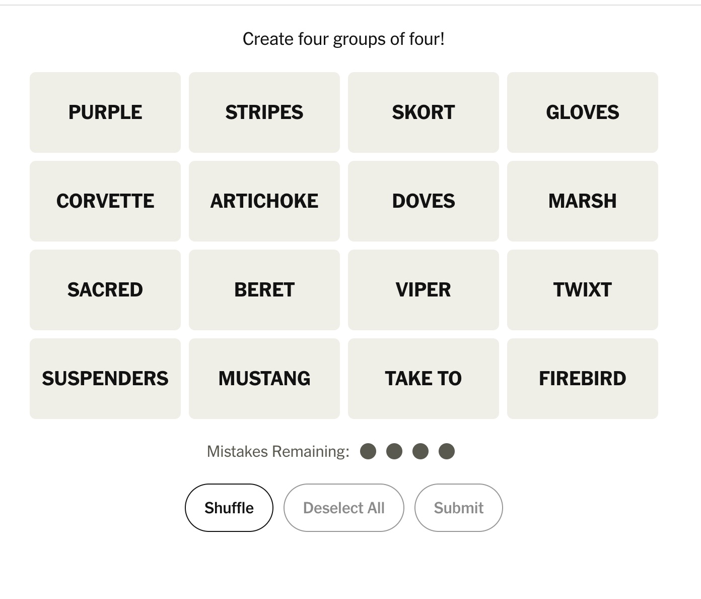
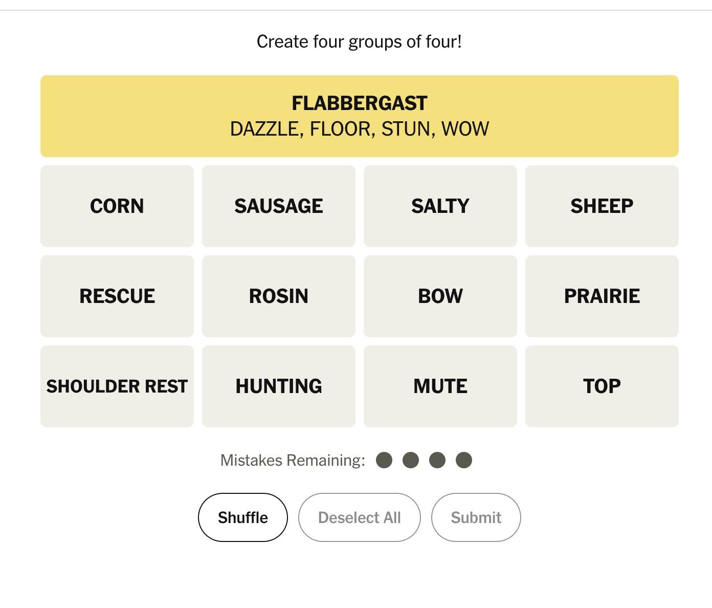
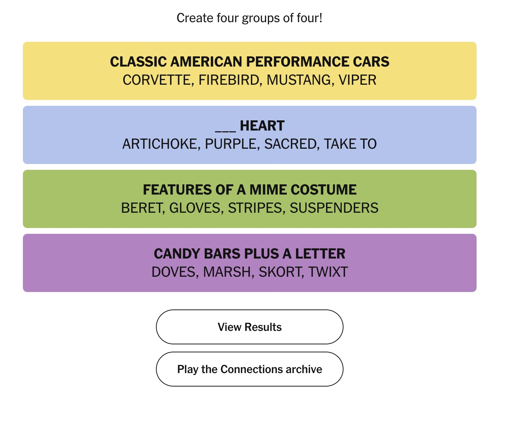

# Game Description

### Name

Links

### Summary

Links is a NYT Connections clone intended to be used by a small group of friends so that they can reate their own Connections puzzles to challenge each other! This is not intended to compete with NYT or generate revenue, but instead provide a simple-to-use interface for solving custom made Connections. Links will be web-based game compatible with mobile devices and desktops.

## Behavior

Links has two modes: Solving and Creating. In Solving mode, the game plays exactly like Connections (described below). In Creating mode, the user can create their own Connections puzzle to share with friends.

### Solving Mode

The user is presented with a 4x4 grid of words or phrases. Their goal is to find 4 groups of tiles that share a theme or connection. They can select a tile in the grid one at a time with a max selection of 4 tiles. When they have selected 4 tiles, they can press the "Submit" button to check if those 4 selected tiles are part of a group. If they are, the tiles are moved to the top of the grid and the connection theme and color is revealed. The group color (yellow, green, blue, and purple) signifies the difficulty of the group in order (yellow is the most straightforward and purple is the trickiest of the 4 groups). The revealed group should span the grid, with the group theme centered and bold and the group members listed below the theme.

If the 4 selected tiles are not a group, the user uses 1 of their mistakes. After making 4 mistakes, they lose the game. If the selected tiles are 1-off from a group (meaning that 3 out of the 4 tiles belong to the same group), the user should be notified that they are off by one.

The user will continue guessing groups until they make too many mistakes (game over) or they have revealed all of the groups (game win).

In addition to the Submit button, there is also "Shuffle" and "Deselect All". Shuffle rearranges the remaining unmatched tiles. And "Deselect All" untaps the tiles the user has selected.

An example of how the game looks prior to making any guesses 

An example of a game in-progress. The yellow group has been found and moved to the top of the grid. 

An example of a completed puzzle. 

### Creating Mode

In Creating Mode, a user creates their own connections puzzle to be shared with other users. The user will see four, blank group tiles stacked on top of each other from easiest to most difficult (colored yellow, green, blue, and purple). For each group tile, there will be a field to enter the group theme, and four slots to enter the members for each group. Upon filling in all fields, the user can hit "Submit" and they are shown their puzzle in "Solving Mode". The user can solve their own puzzle to test it out. If they wish to make changes to the puzzle they can click "Edit" and be taken back to editing each field for each group. If they are satisfied with the puzzle they can click share to copy a link to the puzzle

#### Puzzle Sharing

A vital part of Links is sharing puzzles amongst each other. However, I do not want to require users to create an account, or to save all these puzzles in an online storage. If possible, I want the link to the puzzle itself to contain all of the necessary information. A proposed solution would be creating a hash of the puzzle and storing that in the url. The website can decode the hash and configure the puzzle as necessary.

